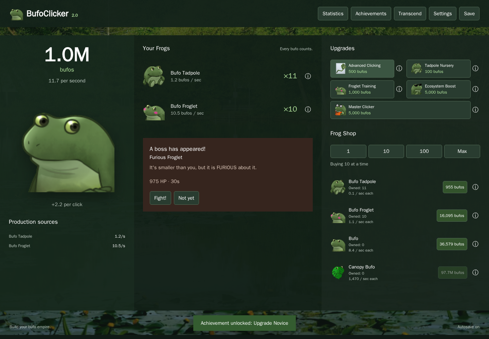

# BufoClicker

A browser idle game about building a bufo empire, now written in COBOL.

Click Bufo, buy frogs that produce bufos, unlock upgrades and achievements, fight bosses, and transcend for permanent bonuses. The game runs locally in your browser through WebAssembly. GitHub Pages serves the static files.

This is an updated fork of [pjscheetz/BufoClicker](https://github.com/pjscheetz/BufoClicker).



[Mobile layout](docs/screenshots/mobile.png) · [Boss fight](docs/screenshots/boss.png)

## Run the game

Install Docker with Compose, then run:

```bash
docker compose up dev
```

Open [localhost:9000](http://localhost:9000). The first build compiles the COBOL runtime dependencies. After changing source files, restart the service to rebuild:

```bash
docker compose restart dev
```

Development builds expose `debugTools` and `cobol` in the browser console. `debugTools.help()` lists the game helpers. No Node installation is required on your host.

## Build and preview

Build the static site into `dist/`:

```bash
docker compose run --rm build
```

Preview a production build:

```bash
docker compose up --build site
```

Open [localhost:8080](http://localhost:8080). Production builds do not expose the developer facade. Both a site root and a path such as `/BufoClicker/` are supported.

## Save your progress

The game saves in this browser. Open **Settings** to export a backup or import a save from another browser. Existing TypeScript saves migrate when the COBOL save key is absent. The legacy save remains available for recovery.

If a save is corrupt or storage fails, the game shows recovery controls. An unsuccessful import or reset does not replace your progress. Offline production is capped at 12 hours.

## Verify a change

Build the toolchain and run native and WebAssembly checks:

```bash
docker build --target tools -t bufoclicker-cobol-tools .
docker run --rm -v "$PWD:/app" -w /app bufoclicker-cobol-tools ./scripts/test.sh
```

Build the development site and run browser checks:

```bash
docker run --rm -v "$PWD:/app" -w /app -e BUILD_MODE=development bufoclicker-cobol-tools ./scripts/build.sh
docker build -t bufoclicker-browser-tests tests/browser
docker run --rm -v "$PWD:/app" -w /app bufoclicker-browser-tests
```

Browser checks cover Chromium, Firefox, and WebKit at root and subpath URLs. Reports and screenshots go to `build/browser-evidence/`. All Node commands for the test harness run inside containers.

## Read the implementation notes

- [Architecture decision](docs/adr/0001-port-client-to-cobol-and-webassembly.md)
- [Parity, adaptations, and evidence](docs/cobol-parity.md)
- [COBOL and browser ABI](vendor/ABI.md)
- [Runtime dependencies and relinking](vendor/RUNTIME.md)

COBOL contains application behavior and markup. C and JavaScript provide generic runtime and browser bindings. Assets, stylesheets, and catalog JSON remain static files. GitHub Actions builds `dist/` and publishes it when a change reaches `main`.
