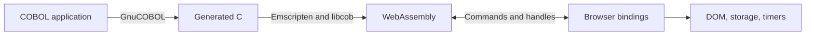

# Port the complete client to COBOL and WebAssembly

BufoClicker is a static browser game. This conversion replaces its TypeScript application with COBOL while retaining static hosting, saved progress, and the complete game. It is an alternative to the [Rust proposal](https://github.com/riptidewave93/BufoClicker/pull/2), with the Explorer subsystem retained.

## Decision

Compile GnuCOBOL 3.1.2 to C, then compile that C and libcob to WebAssembly with Emscripten. Run the same COBOL modules natively for deterministic tests. The browser downloads the runtime and runs the game locally. There is no application server.

COBOL owns the game rules, state transitions, persistence policy, UI markup, UI actions, component lifecycle, and developer API. Small C and JavaScript adapters provide JSON ownership, IEEE arithmetic, formatting primitives, DOM access, timers, storage, and browser events. HTML, CSS, images, and JSON remain static assets. This is a full application conversion, but the browser cannot execute COBOL without those adapters.

The conversion includes all generator, upgrade, achievement, prestige, Golden Bufo, boss, Explorer, combat, utility, and component modules. The original catalogs and artwork remain authoritative. Catalog JSON is packaged in Emscripten's data file, so a catalog edit requires a rebuild. Browser paths are relative and support both `/` and `/BufoClicker/`.

The UI retains the three-column game structure and artwork. It uses dark backgrounds and white primary text. The new save controls expose import and export without a developer console. Developer tools are exposed only by development builds.

## Saves

Read current saves from `bufo_idle_save_cobol_v1`. If that key is absent, read the TypeScript key `bufo_idle_save`. The nested legacy state is authoritative. Retain the legacy bytes after migration. Explicitly clearing saved data removes both keys. A present but empty or invalid current value blocks fallback and automatic writes.

New saves have a format identifier and schema version independent of the application version. Imports accept JSON and the original `btoa(encodeURIComponent(JSON.stringify(save)))` export format. Validate a fresh candidate and write it before activating it. Failed import or reset leaves live progress and stored bytes unchanged.

Elapsed production uses permanent bonuses, a one-minute threshold on reload, no threshold on tab return, and a 12-hour cap. Persist credited progress before activating it. If persistence fails, pause the uncredited snapshot and retain one retry source. A successful retry discards that source. Repeated lifecycle events cannot credit the same interval twice.

Every serialized candidate rebuilds permanent derived values. Saving during a visible frenzy preserves the live frenzy, while the saved copy contains no temporary multipliers. Restore unlocked achievements without granting their one-time currency rewards again.

## Runtime constraints

Browser numbers use IEEE binary64. Cost calculations and exact affordability comparisons use generic C arithmetic where COBOL decimal intermediates would change JavaScript results. Native and WebAssembly builds run the same source-derived vectors.

WebAssembly C generation uses an actual 32-bit GnuCOBOL compiler through QEMU. A 64-bit compiler emits incompatible pointer fields. The build also corrects two generated libcob configuration entries after checking target integer widths. These details and the JSON function ABI are recorded in [the runtime contract](../../vendor/ABI.md).

The browser boundary transfers owned JSON values and explicit callback, component, and element references. It does not preserve arbitrary JavaScript object identity, inherited prototypes, or cyclic graphs. The [parity reference](../cobol-parity.md) records these adaptations and the tested boundaries.

## Alternatives and consequences

A COBOL server would require hosting infrastructure and change the offline browser model. Keeping TypeScript UI behavior would leave a partial conversion. A JavaScript COBOL interpreter would add another language runtime without using the same native executable for verification.

The selected approach adds a WebAssembly startup download and a cross-compilation toolchain. It also makes browser ownership and callbacks explicit. The game remains a static site, and deterministic native checks can exercise the actual application code.

libcob and GMP retain their LGPL notices. Production output includes the corresponding source archives, and the build scripts support relinking modified libraries. See [runtime dependencies](../../vendor/RUNTIME.md).

## Delivery gate

Run native and WebAssembly parity checks, persistence fault tests, public API checks, and browser interactions at both supported path layouts. Check desktop and mobile viewports in Chromium, Firefox, and WebKit. Linux WebKit coverage does not establish behavior on a physical iPhone.

Replace the static build and remove the TypeScript application only after those checks pass. Keep the PR as a draft for maintainer review. This change does not deploy or merge itself.
