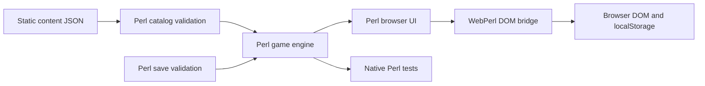

# Perl/WASM migration

This port replaces the application language while retaining static hosting.
The [ADR](adr/0001-port-client-to-perl-and-webassembly.md) explains the runtime
choice. This document describes the implementation boundaries and compatibility
rules for reviewing the change.

## Architecture



The engine receives time as an argument. Economy, achievement rewards, boss
health and prestige do not depend on a browser or a wall-clock lookup. Views
read one authoritative state. They do not maintain independent copies of
purchase counts or click power.

Catalogs retain the original JSON format and IDs: 14 generators, 91 upgrades
and 50 achievements. Boss definitions retain the seven original IDs and health
values. The browser loads all three catalogs before accepting a save or
starting timers. Invalid data produces a startup error, not an empty game.

## State and effects

Durable state stores current and run-total currency, click count, generator
ownership, enable flags, custom boosts, purchased upgrades, optional configured
upgrade definitions, achievement unlocks and custom event flags, complete
Explorer data, prestige, boss history and game settings. Generator definitions and derived
production are reconstructed from the catalogs.

Click power combines the base value, click upgrades and achievement rewards,
prestige, banked boss rewards and any active click frenzy. Production uses
its own upgrade and achievement multipliers. A production upgrade does not
multiply clicks. The engine rebuilds these values in one place.

The Golden manager owns spawn deadlines, IDs, positions, collection and expiry.
The browser renders its events. The engine classifies a supplied random sample
and applies the resulting reward. Boss
countdowns and temporary frenzy expiry belong to the engine. UI movement and
result-modal guards do not determine whether damage or rewards count.

## Save migration

| Input | Result |
| --- | --- |
| Valid Perl key | Restore Perl progress, regardless of any legacy key. |
| No Perl key, valid legacy key | Validate legacy nested state, create Perl progress, keep legacy value. |
| Invalid Perl key | Show recovery choices and block automatic writes. |
| Invalid legacy key on first migration | Show recovery choices and preserve the original value. |
| No saved keys | Start a fresh game. |
| Failed import or reset write | Keep current game and stored progress. |

The old envelope contains duplicate generator, upgrade and explorer values
outside `state`. Migration uses the nested state, matching the original loader.
Missing prestige and boss fields use backward-compatible defaults. Older
prestige saves can use `points` when `lifetimePoints` is absent.

The new schema has its own version and storage key. The legacy save remains a
recovery source, not a second target for ongoing writes. Moving between origins
still requires export/import because browser storage belongs to an origin.

Two baseline effect bugs are corrected explicitly: reloads do not replay
one-time achievement payouts, and prestige retains the effects of retained
achievements. Bulk Max purchases also verify the rounded actual price instead
of trusting only a logarithmic estimate. These corrections preserve earned
progress and the documented reward rules; catalog balance is unchanged.

## Time and lifecycle

The visible game uses the original fixed-step animation-frame loop, with a
one-second accumulation cap and a separate 100 ms UI tick. Hiding the tab saves and pauses
the game. A paused fight keeps its remaining time; temporary frenzies stop.
Returning to the tab credits permanent generator production for the elapsed
gap before resuming. It does not run the boss timer through the hidden period.

Reload credit has a one-minute floor. Tab return has no floor. Both paths cap
credited time at 12 hours. Neither path restores a temporary frenzy. Purchases,
manual Save, periodic autosave and page lifecycle handlers persist progress.

## Packaging and hosting

The Perl build script concatenates application packages in dependency order.
It registers all bundled module names in `%INC` before consumers use them.
Perl packages expose methods or fully qualified functions; they do not depend on
compile-time exports from packages concatenated later in the bundle.
The result is a single `app.pl` loaded by an external `text/perl` script tag.

The build copies the existing styles, images and catalogs. CSS imports occur
before style rules so native browser loading follows the same module order as
the old webpack loader. `mobile.css` remains the last base import. Relative
URLs support both site-root hosting and `/BufoClicker/` without a server API.

Docker supplies native Perl, download tools and pinned Binaryen 108. The build
applies the arithmetic compatibility transform described in the ADR before
packaging WASM. nginx serves the resulting
static tree. GitHub Actions builds that same tree for Pages. Browser checks use
a Perl WebDriver client against an isolated Selenium Chromium container; no
Node application toolchain is required.

## Complete application surface

The conversion includes the original Explorer manager, pure Explorer model,
enemy templates and combat helpers. Pure-model exploration and manager exploration
retain their different algorithms. Explorer completion updates its own totals;
the original unused GameCore callbacks do not credit the main bank. Progress and
healing use simulation deltas, while completion rewards retain the original
wall-clock duration calculation.

Core events, state snapshots and subscriptions, logger controls, storage,
loading, timing, mathematics, validation and general utilities have Perl APIs.
Browser components retain their lifecycle, container, update, tooltip, animation,
modal and notification operations. An explicit development build exposes the
original developer groups through callbacks into those services.

The [source map](source-map.md) accounts for every original module and export.
The [development guide](development.md) describes the restored console and native
interfaces. The application has one current Game, one shared EventBus and one
browser persistence path, including after an atomic import or reset.

## Source size

The original application has 17,945 physical lines across 64 TypeScript files.
The Perl application has 10,229 lines across 56 files. About 80% of that reduction
comes from comments and blank lines. These are formatting-sensitive counts.

The full conversion consolidates modules and replaces TypeScript interfaces with
Perl data and callback contracts. The original source also contains substantially
more comments and blank lines. A smaller physical line count alone does not
establish that behavior was preserved. The source map and comparisons against
original execution provide that evidence.

Counts exclude tests, build scripts, browser runners, generated output, runtime
files, styles, and assets. The comparable original set is `src/**/*.ts` plus
`styles/styleLoader.ts`; the Perl set is `lib/**/*.pm` plus `web/app.pl`.
Regenerate the physical line totals from the repository root:

```sh
git ls-tree -r --name-only fc7f61a -- src styles/styleLoader.ts |
  while IFS= read -r path; do git show "fc7f61a:$path"; done |
  wc -l
(cat web/app.pl; rg --files lib -g '*.pm' | xargs cat) | wc -l
```

## Review evidence

The [parity matrix](parity.md) maps gameplay and persistence behavior to checks.
The [verification record](verification.md) records actual commands, browser
coverage, measured runtime costs and screenshots. Native tests prove rules;
browser tests prove wiring and interactions. Screenshots establish rendered
appearance, not gameplay correctness.
