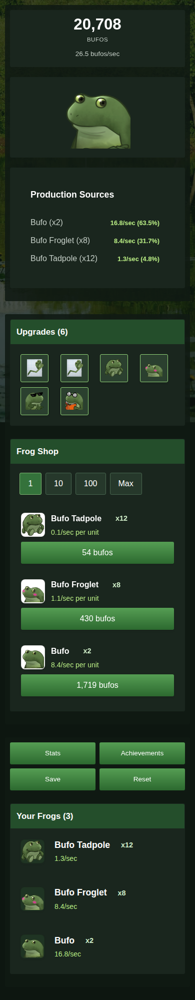
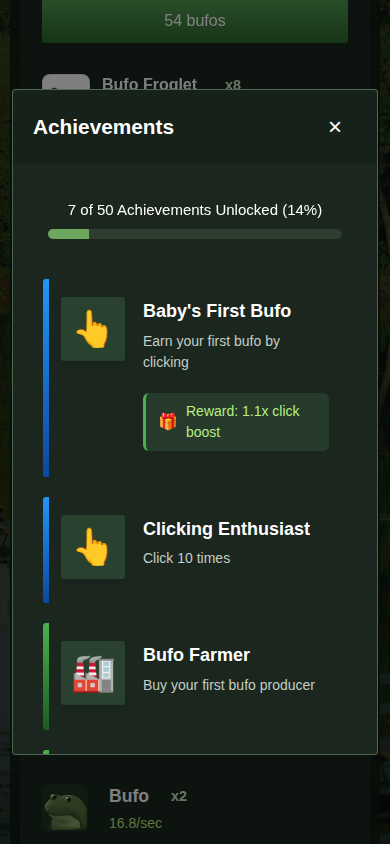
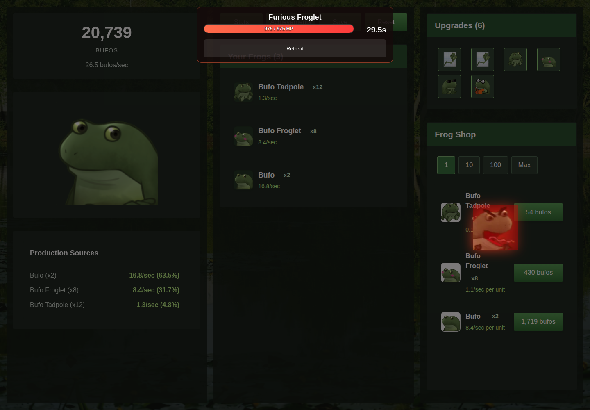

# Verification record

The port was exercised against its built static site, including the production
Docker image. The checks below distinguish native game rules, browser wiring
and visual inspection. No upstream deployment was changed.

## Reproduce

```sh
docker compose run --build --rm test
docker compose --profile browser run --build --rm browser-test
docker compose --profile browser down
```

On Linux, set `BUFO_UID=$(id -u) BUFO_GID=$(id -g)` before the browser command
when your user differs from the default UID/GID 1000. The bind-mounted
`artifacts/` directory must be writable. CI sets these values automatically.

The browser runner uses Perl's core HTTP and JSON modules to drive an isolated
Selenium Chromium container. It visits both `/` and `/BufoClicker/`, writes
screenshots, and records runtime download measurements. It does not need Node
or access to a personal browser profile. Fixture injection calls the same Perl
game API used by the app; normal actions use browser controls.

## Executed checks

| Layer | Result and scope |
| --- | --- |
| Native Perl | 362 assertions passed across catalog, number, engine and save tests. |
| Production Chromium 138.0.7204.183 | 91 assertions passed through `scripts/browser-test.pl` and its fault helper. |
| Firefox 146.0.1 | Both routes loaded; clicking, purchase, reload and Stats passed with no page errors. [Report](verification-data/firefox.json). |
| Responsive layout | Chromium and Firefox controls fit widths 375, 390, 412 and 768 px; inspected controls met the 44 px target. |
| Short-window controls | Chromium 145.0.7632.0 and Firefox 146.0.1 opened Reset at 800×600 and 375×667 with the boss invitation visible. |
| Build and workflows | Production Docker build, Compose configuration and actionlint 1.7.7 passed. |

The repeatable Chromium suite covers clicks, unaffordable purchases, generators,
upgrades, Stats, export/import, bosses and result guards, Golden Bufo collection,
prestige, large arithmetic, late-game purchase/reload and pagehide persistence.
It also checks legacy migration without altering the source, current-key
precedence, corrupt-save recovery, explicit reset and storage-failure atomicity
for import, reset and prestige.

Fault injection blocks a required catalog download and verifies that startup
stops without touching either save key. A simulated 24-hour hidden interval
credits exactly 12 hours of permanent production and preserves fight health
and time. This is a controlled lifecycle check, not an actual 24-hour browser
suspension test. Separate local checks exercised missing, malformed and
semantically invalid catalogs before the committed fault runner was assembled.

## Failures that drove fixes

| Reproduced failure | Fix and passing evidence |
| --- | --- |
| Unmodified WebPerl trapped on `15000000000 * (1.6 ** 0)`. | Pinned Binaryen compatibility pass; native/browser multiplication vectors through `1e100` agreed. The committed browser suite checks the original expression and purchase/reload with a `1e20` balance. |
| WebPerl ended the interpreter before pagehide, producing unload errors. | Remove the pinned bridge's eager shutdown hook. A click survives refresh without manual Save, and normal flows report no browser errors. |
| Replacing `dist/` invalidated the running preview's directory bind mount and returned HTTP 404. | Keep the output directory and replace its children. Rebuilding the mounted preview returned HTTP 200. |
| A number-format comparison disagreed with original comma grouping below one million. | Match the original threshold and requested decimals; native formatting tests and UI comparison passed. |
| The boss invitation intercepted a bottom-aligned Reset control in short windows. | Reserve scroll space while the invitation is visible. Direct pointer clicks opened Reset in both tested browsers and sizes. |
| Opening `/BufoClicker` without a slash dropped the local preview port during redirect. | Use a relative redirect. HTTP checks retain ports 9000 and 8080; the browser runner checks the redirect header. |

## Runtime cost

The [recorded browser measurements](verification-data/runtime-metrics.json)
come from local Docker networking with nginx gzip enabled. The four runtime
files total **16,073,455 bytes decoded** and **4,593,280 bytes compressed**.
Artwork, catalogs, styles and the Perl application add to those totals.

The first root-route run reached the runner's ready observation within 543 ms
of navigation; the subsequent prefix-route observation was 283 ms. These are
single local samples and upper bounds observed by the polling runner. They are
not public-network, cold-device, mobile or comparative performance benchmarks.
The prefix run may benefit from browser runtime caches. The release archive
and build cache are separate from browser download costs.

## Screenshots

Screenshots show the implemented client with deterministic seeded progress.
They preserve the original game artwork and layout with the dark palette.


| Mobile game | Mobile achievements |
| --- | --- |
|  |  |



## Remaining coverage

Safari, iOS, Android devices, touch hardware, prolonged play, memory growth,
real background suspension and poor-network startup were not validated.
Firefox received the smoke and responsive checks above, not the full Chromium
fault matrix. GitHub Pages path behavior was tested locally; the proposed
workflow has not deployed this branch upstream.

The pinned WebPerl beta and its documented compatibility adjustments remain
maintenance risks. The [ADR](adr/0001-port-client-to-perl-and-webassembly.md)
records them explicitly. Screenshot quality does not resolve those runtime
or browser coverage limits.
